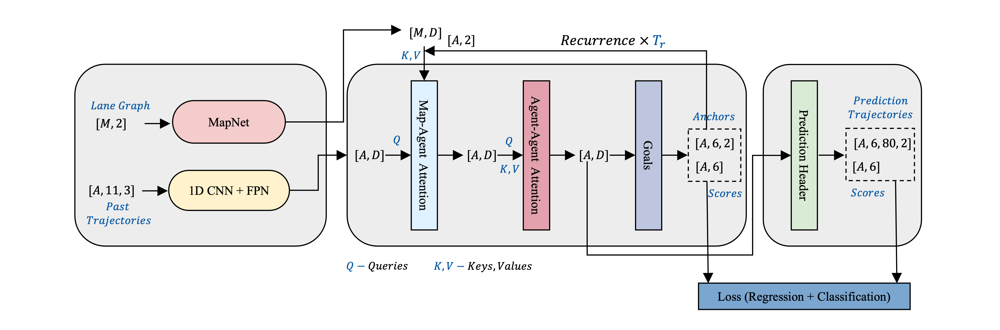
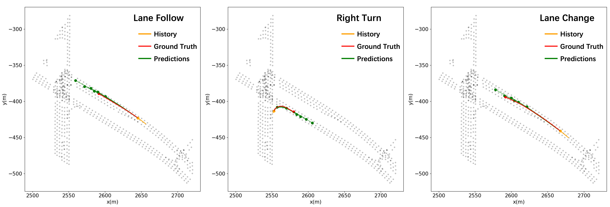

# Goal Driven Multi-Modal Motion Prediction

## Introduction

In this work, we introduce a novel framework known as the **Goal-Driven Motion Prediction Network** (**GoDNet**). GoDNet is engineered to excel in autonomous driving motion prediction tasks by learning from short-term historical observations and vectorized map information. To harness both spatial and temporal dimensions, the framework employs 1D-CNN on historical trajectories, as well as graph convolution on a sparse lane graph. To incorporate interaction-aware information, we introduce specialized cross-attention modules that facilitate nuanced interactions between the map and the actors, as well as among the actors themselves. Additionally, we have designed a goal-driven unit to enhance the model's capacity for long-term predictions across varying scales. Our proposed approach sets a new benchmark, achieving state-of-the-art performance in terms of minimum Final Displacement Error (**minFDE**) and minimum Average Displacement Error (**minADE**) on the **Waymo Open Dataset**.

---

## Architecture


---

## Table of Contents
* [Introduction](https://github.com/LiamTheronC/GoDNet/blob/master/README.md#introduction)
* [Architecture](https://github.com/LiamTheronC/GoDNet/blob/master/README.md#architecture)
* [Get started](https://github.com/LiamTheronC/GoDNet/blob/master/README.md#get-started)
* [Train and evaluation](https://github.com/LiamTheronC/GoDNet/blob/master/README.md#train-and-evaluation)
* [Results](https://github.com/LiamTheronC/GoDNet/blob/master/README.md#results)
* [License](https://github.com/LiamTheronC/waymo_motion_prediction/blob/main/README.md#license)

---
## Get started
Recommended: Ubuntu 20.04 or higher.
### 1. Installation
> A step-by-step installation guide. 
1. Create a conda virtual environment and activate it.
```
conda create -n waymo python=3.8 -y
conda activate waymo
```
2. Install PyTorch following the [official instructions](https://pytorch.org/).
```
conda install pytorch==1.5.1 torchvision cudatoolkit=10.2 -c pytorch
```
3. Install TensorFlow following the [official instructions](https://www.tensorflow.org/install?hl=zh-cn).
```
pip install tensorflow==2.4
```
4. Install waymo open dataset dependencies according to the [reference](https://github.com/waymo-research/waymo-open-dataset).
```
!pip install waymo-open-dataset-tf-2-11-0==1.6.0
```
5. Install Google Protocol Buffers.
```
pip install protobuf
```
6. Clone the GoDNet repository.
```
git clone https://github.com/LiamTheronC/GoDNet.git
```
### 2. Prepare dataset
> The motion dataset is provided as sharded TFRecord format files containing protocol buffer data. The data are split into training, test, and validation sets with a split of 70% training, 15% testing and 15% validation data.
```
cd GoDNet/working
mkdir dataset && cd dataset
mkdir train val test
```
1. Download the full dataset from Google Cloud to the directories respectively following the [official instructions](https://waymo.com/open/).

2. Make sure the folder structure is:
```
GoDNet
├── working/
    ├── dataset/
        ├── train/
        ├── val/
        └──test/
    ├── dataLoader/
    ├──model/
    ├── preprocess/
        ├── preprocess_exe.py
        |...
    ├── train.py
    |...

```
3. Preprocess the dataset following [Waymo-Motion-Preprocess](https://github.com/LiamTheronC/Waymo-Motion-Preprocess).
```
python preprocess_exe.py train --downsample-factor=10 --type-feats=vp
```
---

## Train and evaluation

### Prerequest
Please ensure you have prepared the environment and the Waymo Open Dataset dataset.

### Train
Train GoDnet with 8 GPUs.
```
./dist_train.sh vp 8
```

### Visualization
see [plot.py](https://github.com/LiamTheronC/GoDNet/blob/master/working/plot.py).

---

## Results
### Result in metrics

| FirstName     | LastName      | City     |
| ------------- | ------------- | -------- |
| John          | Test1         | NewYork  |
| Bob           | Test2         | Toronto  |

### Visualization of the results.


---
 
## License
  
The work is released under the MIT license.
  
---
